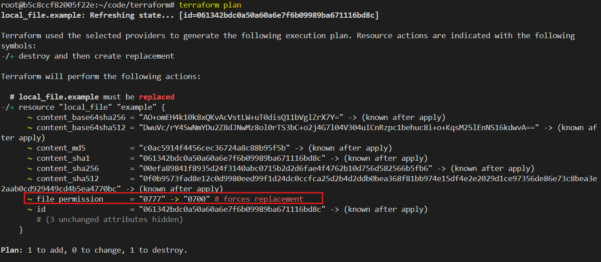
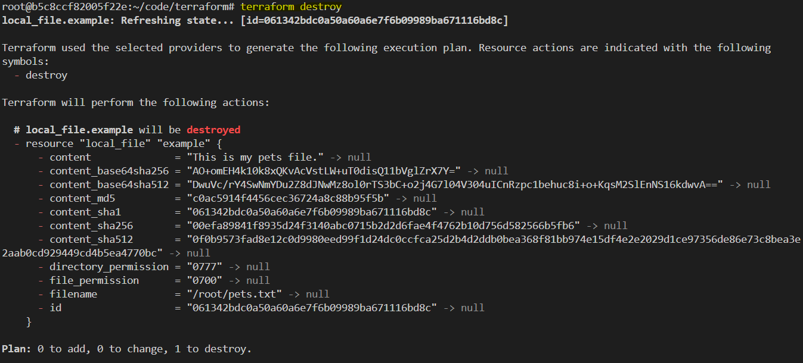

# Updating and Destroying Infrastructure Using Terraform

In this lab, we will learn how to create, update, and destroy infrastructure using Terraform. Terraform is a powerful Infrastructure as Code (IaC) tool that allows you to define and provision infrastructure using a high-level configuration language.

### Scenario Description:
You are tasked with managing a file named `pets.txt` on a server using Terraform. The file does not exist initially. You will create this file with default content and permissions, update its permissions to ensure only the file owner has access to it, and finally, destroy the file to clean up the infrastructure.

### Objectives:
1. Create a local file named `pets.txt` with default permissions.
2. Update the file permissions of `pets.txt` from `0777` to `0700`.
3. Destroy the `pets.txt` file and clean up the infrastructure.

### Step 1: Creating the File

#### Create a Terraform Project Directory

```sh
mkdir terraform
cd terraform
```

#### Create Terraform Configuration
First, create a Terraform configuration file, typically named `main.tf`, to define the resource. The initial configuration will create a file named `pets.txt` with default content and permissions.

```py
# main.tf
resource "local_file" "example" {
  filename = "pets.txt"
  content  = "This is my pets file."
  file_permission = "0777"
}
```

#### Initialize Terraform
Initialize Terraform to set up the project directory.

```sh
terraform init
```

#### Apply the Configuration
Apply the configuration to create the file.

```sh
terraform apply
```

Type `yes` when prompted to confirm the creation.


#### Check the Newly Created File Permissions
Verify that the file permissions are applied properly.

```sh
ls -l pets.txt
```


**Explanation:** The `file_permission` argument is set to "0777", which means that the file is created with read, write, and execute permissions for everyone (owner, group, and others).

### Step 2: Updating the File Permissions

#### Modify Terraform Configuration
Update the Terraform configuration to change the file permissions to `0700`.

```py
# main.tf
resource "local_file" "example" {
  filename = "pets.txt"
  content  = "This is my pets file."
  
  # Update the file permission to 0700
  file_permission = "0700"
}
```

#### Run Terraform Plan
Run the `terraform plan` command to preview the changes.

```sh
terraform plan
```
The output will indicate that the resource will be replaced. The `-/+` symbol at the beginning of the resource name shows that it will be deleted and then recreated. The line with `forces replacement` highlights that the file permission change triggers this replacement.



#### Apply the Changes
Apply the changes to update the file permissions.

```sh
terraform apply
```

Type `yes` when prompted to confirm the update.

#### Check the File Permission Status
Verify that the file permissions are applied properly.

```sh
ls -l pets.txt
```


**Explanation:** The `file_permission` argument is updated to "0700", which means that only the owner has read, write, and execute permissions, while the group and others have no permissions.

### Step 3: Destroying the File

#### Run Terraform Destroy
To delete the file and clean up the infrastructure, run the `terraform destroy` command.

```sh
terraform destroy
```

The execution plan will show that the resource will be destroyed, with all its arguments marked with a `-` symbol.

Confirm the destroy operation by typing `yes` when prompted.

This command will delete the file `pets.txt` and any other resources defined in the current configuration directory.



## Conclusion

In this lab, we learned how to manage infrastructure using Terraform by creating, updating, and destroying a file resource. We started by creating a file named `pets.txt`, updated its permissions, and finally destroyed the file to clean up the infrastructure. This step-by-step approach helps in understanding the lifecycle of infrastructure management using Terraform. Now, proceed to the hands-on labs to practice these operations and reinforce your learning.