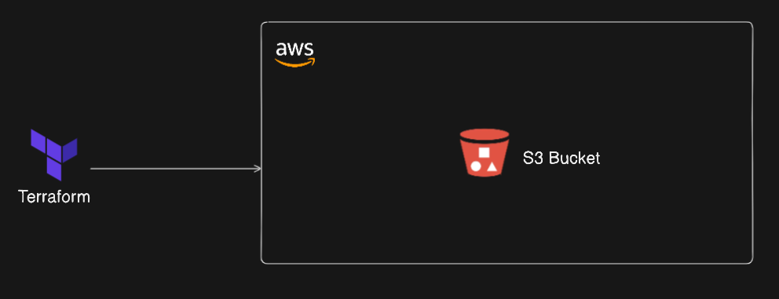
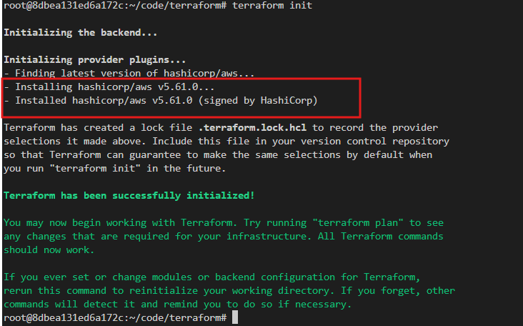
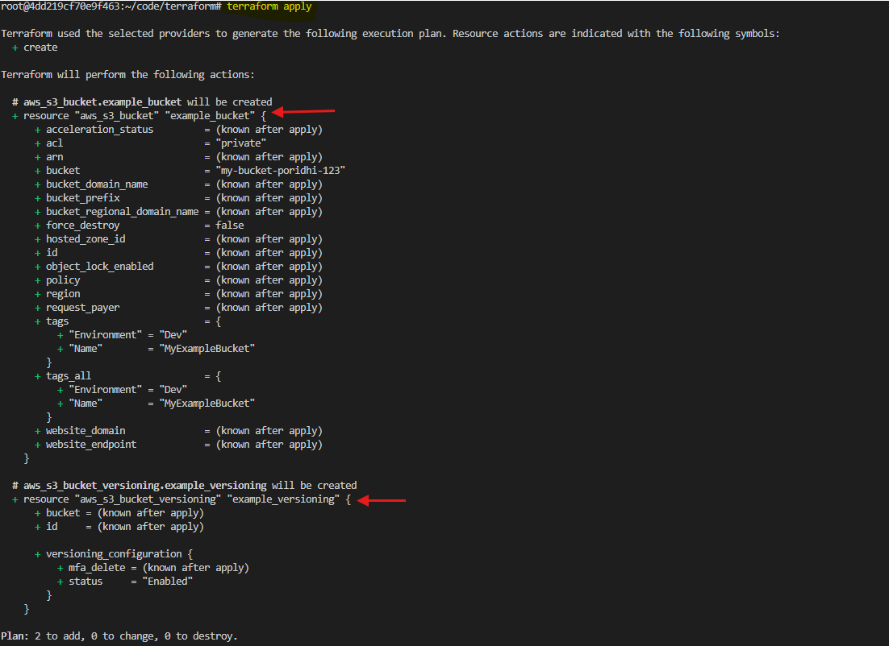
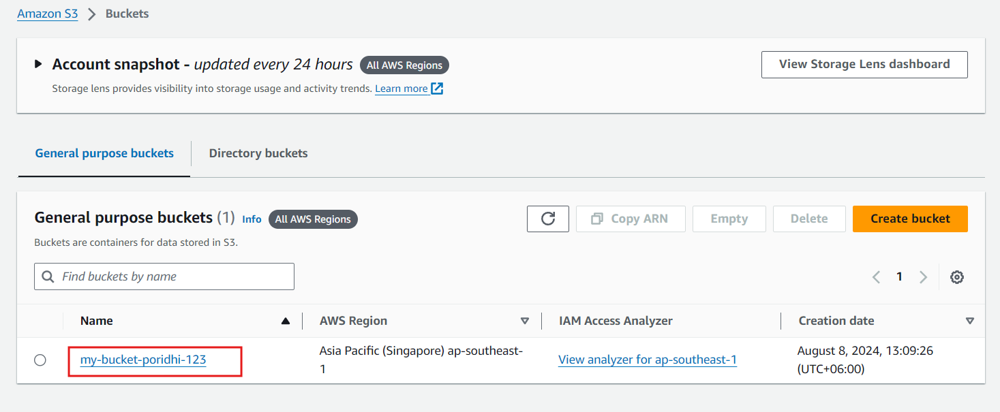

# Creating an S3 Bucket in AWS with Terraform

## Introduction

In this lab, we will learn how to create an S3 bucket with versioning enabled using Terraform. Amazon S3 (Simple Storage Service) is an object storage service that offers industry-leading scalability, data availability, security, and performance. This lab will guide you through the process of creating an S3 bucket, enabling versioning, and tagging the bucket for better management and organization.



## Objectives

1. Understand the basics of Amazon S3 and bucket configuration.
2. Create an S3 bucket using Terraform.
3. Enable versioning on the S3 bucket.
4. Add tags to the S3 bucket.
5. Verify the setup.

## Prerequisites

- An AWS account with permissions to create S3 buckets.
- Terraform installed on your local machine.

## Understanding S3 Concepts

### S3 Buckets

An **S3 bucket** is a container for storing objects (files). You can store any number of objects in a bucket, and each object can be up to 5 terabytes in size. Buckets are region-specific, and the name of the bucket must be unique across all AWS accounts.

#### Key Components of an S3 Bucket

- **Bucket Name**: A unique name for the bucket.
- **Region**: The AWS region where the bucket is created.
- **Access Control List (ACL)**: Permissions for the bucket (e.g., `private`, `public-read`).

### S3 Bucket Versioning

**Versioning** in S3 allows you to keep multiple versions of an object in the same bucket. Versioning can help you recover from both unintended user actions and application failures.

#### Key Features of S3 Bucket Versioning

- **Enabled**: All versions of objects are stored.
- **Suspended**: Stops accruing new versions, but existing versions remain.

### Step 1: Setting Up Terraform Configuration

#### Install AWS CLI

Before proceeding, ensure that the AWS CLI is installed on your local machine. Follow the instructions below based on your operating system:

- **Windows**:
  1. Download the AWS CLI MSI installer from the [official AWS website](https://aws.amazon.com/cli/).
  2. Run the downloaded MSI installer and follow the instructions.

- **Linux**:
  ```sh
  curl "https://awscli.amazonaws.com/awscli-exe-linux-x86_64.zip" -o "awscliv2.zip"
  unzip awscliv2.zip
  sudo ./aws/install
  ```

#### Configure AWS CLI

After installing the AWS CLI, configure it with the necessary credentials. Run the following command and follow the prompts to configure it:

```sh
aws configure
```

- **Explanation**: This command sets up your AWS CLI with the necessary credentials, region, and output format.


You will find the `AWS Access key` and `AWS Seceret Access key` on Lab description page,where you generated the credentials


#### Create a New Terraform Configuration File

Create a new directory for your Terraform project and navigate to it. Create a file named `main.tf` to define the S3 bucket and its configuration.

```py
# main.tf

provider "aws" {
  region = "ap-southeast-1"
}
```

- **Explanation**: This sets up the AWS provider and specifies the region (`ap-southeast-1`) where resources will be created.

### Step 2: Create an S3 Bucket

#### Define the S3 Bucket

Add a resource block to define an S3 bucket with specific ACL and tags.

```py
resource "aws_s3_bucket" "example_bucket" {
  bucket = "my-bucket-poridhi-123"
  acl    = "private"

  tags = {
    Name        = "MyExampleBucket"
    Environment = "Dev"
  }
}
```

- **Explanation**:
  - **`bucket`**: Specifies the name of the S3 bucket. The name must be unique across all AWS accounts.
  - **`acl`**: Sets the access control list to `private`, meaning only the bucket owner has access to the bucket.
  - **`tags`**: Adds metadata to the bucket to help identify and organize it.

### Step 3: Enable Versioning on the S3 Bucket

#### Define the Bucket Versioning

Add a resource block to enable versioning on the S3 bucket.

```py
resource "aws_s3_bucket_versioning" "example_versioning" {
  bucket = aws_s3_bucket.example_bucket.id

  versioning_configuration {
    status = "Enabled"
  }
}
```

- **Explanation**:
  - **`bucket`**: References the S3 bucket created earlier.
  - **`versioning_configuration`**: Enables versioning on the bucket.

### Step 4: Initializing and Applying Terraform

#### Initialize Terraform

Initialize your Terraform workspace to download the required provider plugins:

```sh
terraform init
```



#### Apply the Configuration

Apply the Terraform configuration to create the S3 bucket and enable versioning:

```sh
terraform apply
```


Type `yes` when prompted to confirm the creation of resources.

### Step 5: Verifying the Setup

#### Verify in AWS Console

1. **S3 Bucket**: Navigate to the S3 section in the AWS Console and verify that the bucket `my-bucket-poridhi-123` is created.


2. **Versioning**: Check that versioning is enabled for the bucket.


## Conclusion

In this lab, you learned how to create an S3 bucket and enable versioning using Terraform. You defined an S3 bucket with a unique name and private ACL, enabled versioning on the bucket, and added tags for better management. This exercise demonstrates the power of Terraform in managing AWS S3 resources, highlighting best practices for data storage and version control.